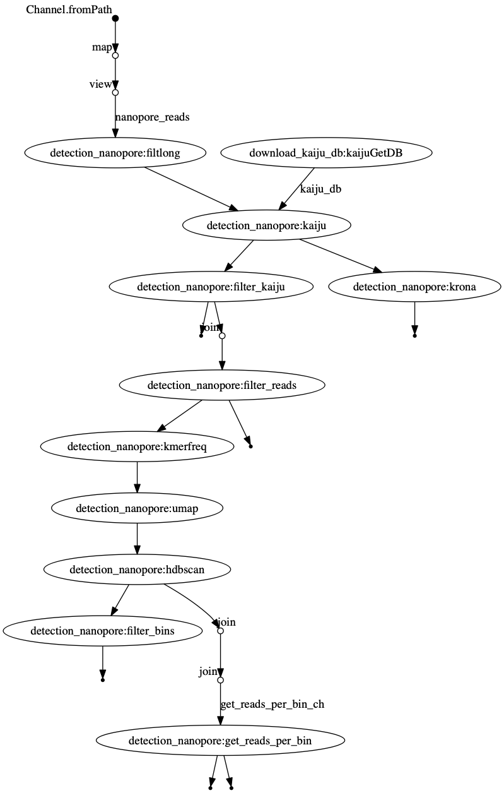

# Nanovirus

A nextflow implementation of the assembly-free detection of viruses from long-read Nanopore data.
The implementation is based on Beaulaurier _et al_. 2019, "Assembly-free single-molecule nanopore sequencing
recovers complete virus genomes from natural microbial communities". [https://www.biorxiv.org/content/biorxiv/early/2019/04/26/619684.full.pdf]

## Basic execution

````
nextflow run main.nf --nanopore 'example_data/nanopore.fastq'
````

See 

````
netflow run main.nf --help
````

for more parameter options. 


## Example test data

To be able to test the execution of the workflow with small example read data sets we obtained Nanopore data from a marine plankton metagenome study ([Beaulaurier et al. (2019)][1]). Data was [downloaded][2] and a small sequence subset was selected:

### Nanopore 

````
wget -O - ftp://ftp.sra.ebi.ac.uk/vol1/fastq/SRR881/000/SRR8811960/SRR8811960_1.fastq.gz | gunzip -c SRR8811960_1.fastq.tmp; head -20000 SRR8811960_1.fastq.tmp | gzip > example_data/SRR8811960.fastq.gz
````

[1]: https://www.biorxiv.org/content/10.1101/619684v1
[2]: https://www.ebi.ac.uk/ena/browser/view/PRJNA529454

## DAG chart


